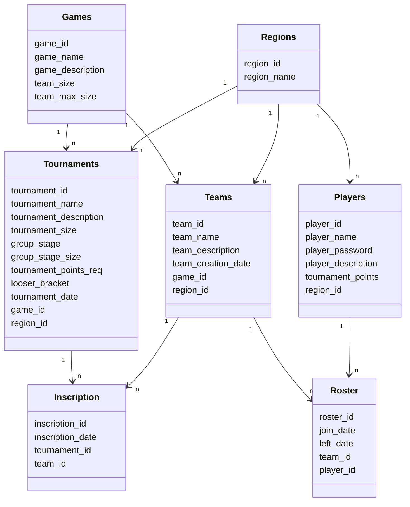
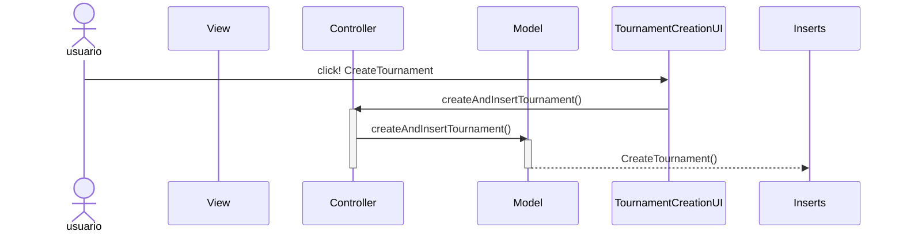
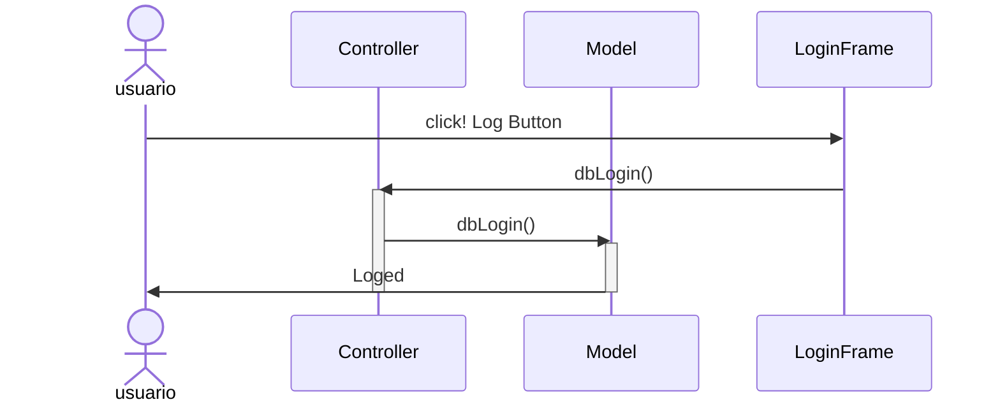

# DATABASE SCHEME:

# Champion Forge:
-Nuestra aplicación se basa en un gestor de torneos en el cúal
para diferentes juegos puedas crear tu propio torneo con sus equipos y
jugadores correspondientes y gestionarlos.

# Esquema Entidad Relación:

# Diagrama De Secuencia de Creación de Torneos:

# Diagrama De Secuencia de Iniciar Sesión:

# Diagrama De Clases:
```mermaid
classDiagram
class Controller {
+main()
}
class Deletes{
+deletePlayer(Players)
+deleteTournament(Tournaments)
+deleteTeam(Teams)
+deleteInscription(Inscription)
+deleteMatch(Match)
+deleteRoster(Roster)
+deleteGame(Games)
+deleteRegion(Region)
}
class Inserts{
+createPlayer(Players)
+createTournament(Tournaments)
+createTeam(Teams)
+createInscription(Inscription)
+createMatch(Match)
+createRoster(Roster)
+createGame(Games)
+createRegion(Region)
}
class Updates{
+updatePlayer(Players)
+updateTournament(Tournaments)
+updateTeam(Teams)
+updateInscription(Inscription)
+updateMatch(Match)
+updateRoster(Roster)
+updateGame(Games)
+updateRegion(Region)
}
class Query{
+getPlayers()
+getTournaments()
+getTeams()
+getInscriptions()
+getMatches()
+getRosters()
+getGames()
+getRegions()
}

class Model {
  +createGame(int, String,  String, int,  int)      
  +createInscription(int, String, int, int)
  +createMatch(int, int, int, String, int)
  +createPlayer(int, String, String, String, int, int)     
  +createRegion(int, String)
  +createRoster(int, String, String, int, int)
  +createTeam(int, String, String, String, int, int, int)
  +createTournament(int, String, String,int, boolean, int,
     int, boolean, String, boolean, int, int)
     
  +createAndInsertPlayer(int, String, String, String, int, int) 
  +createAndInsertTournament(int, String, String, int, boolean, int, int, 
  boolean, String, boolean, int, int) 
  +createAndInsertRegion(int, String) 
  +createAndInsertGame(int, String, String, int, int) 
  +createAndInsertInscription(int, String, Tournaments, Teams)
  +createAndInsertMatch(int, Teams, Teams, String, int)
  +createAndInsertRoster(int, String, String, Teams, Players)
  +createAndInsertTeam(int, String, String, String, int, int, int) 
    
  +queryGames(int) 
  +queryInscription(int) 
  +queryMatch(int)
  +queryRoster(int) 
  +queryPlayer(int)       
  +queryRegion(int)      
  +queryTeams(int) 
  +queryTournament(int) 
      
  +deleteGame(Games) 
  +deletePlayer(Players) 
  +deleteInscription(Inscription) 
  +deleteMatch(Match) 
  +deleteRoster(Roster) 
  +deleteRegion(Regions)   
  +deleteTeam(Teams) 
  +deleteTournaments(Tournaments)
  
  +updateGame(Games)
  +updateInscription(Inscription)
  +updateMatch(Match)
  +updatePlayer(Players)
  +updateRegions(Regions)
  +updateRoster(Roster)
  +updateTeam(Teams)
  +updateTournament(Tournaments)

}
class View {
+logIn(Main Frame)
+signIn(Main Frame, String, String)
+createTournament(MainFrame)
+closeUIs(MainFrame)
}
class CustomMenuBar{
+paintComponent(Graphics)
}
class LoginFrame{
+signButtonActionPerformed(ActionEvent)
+logButtonActionPerformed(ActionEvent)
+pwdFieldActionPerformed(ActionEvent)

}
class MainFrame{
+logOutActionPerformed(ActionEvent)
+exitActionPerformed(ActionEvent)
+jLabel1MouseClicked(ActionEvent)
+tournamentMouseClicked(ActionEvent)
+teamsMouseClicked(ActionEvent)
+inspectTournamentsActionPerformed(ActionEvent)
+inspectTeamsActionPerformed(ActionEvent)
+launch()
}
class PlayerCreationUI{
+pwdFieldActionPerformed(ActionEvent)
+signButtonActionPerformed(ActionEvent)
}


class TournamentCreationUI{
+gstageBActionPerformed(ActionEvent)
+signButtonActionPerformed(ActionEvent)
+looserbBActionPerformed(ActionEvent)

}


class Tournaments {
tournament_id
tournament_name
tournament_description
tournament_size
group_stage
group_stage_size
tournament_points_req
looser_bracket
tournament_date
game_id
region_id
}

    class Teams {
        team_id
        team_name
        team_description
        team_creation_date
        game_id
        region_id
    }
    
    class Games {
        game_id
        game_name
        game_description
        team_size
        team_max_size
    }
    
    class Inscription {
        inscription_id
        inscription_date
        tournament_id
        team_id
    }
    
    class Roster {
        roster_id
        join_date
        left_date
        team_id
        player_id
    }
    
    class Players {
        player_id
        player_name
        player_password
        player_description
        tournament_points
        region_id
    }

    class Regions {
        region_id
        region_name
    }
    Tournaments "1" --> "n" Inscription
    Teams "1" --> "n" Inscription
    Teams "1" --> "n" Roster
    Games "1" --> "n" Tournaments
    Games "1" --> "n" Teams
    Players "1" --> "n" Roster
    Regions "1" --> "n" Players
    Regions "1" --> "n" Teams
    Regions "1" --> "n" Tournaments
```


