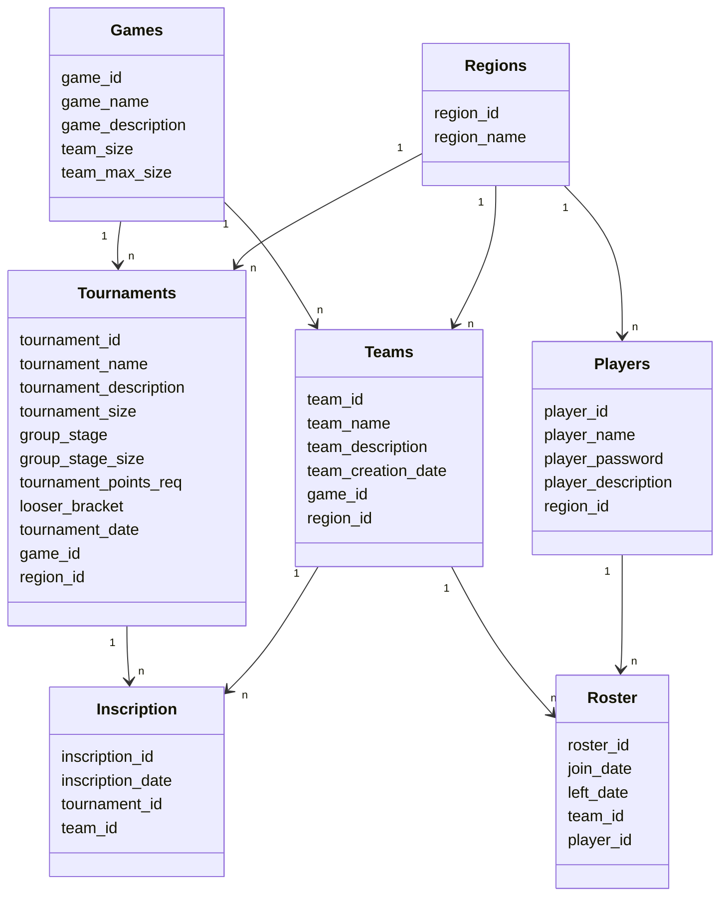

```mermaid
classDiagram
    class Tournaments {
        tournament_id
        tournament_name
        tournament_description
        tournament_size
        group_stage
        group_stage_size
        tournament_points_req
        looser_bracket
        tournament_date
        game_id
        region_id
    }
    
    class Teams {
        team_id
        team_name
        team_description
        team_creation_date
        game_id
        region_id
    }
    
    class Games {
        game_id
        game_name
        game_description
        team_size
        team_max_size
    }
    
    class Inscription {
        inscription_id
        inscription_date
        tournament_id
        team_id
    }
    
    class Roster {
        roster_id
        join_date
        left_date
        team_id
        player_id
    }
    
    class Players {
        player_id
        player_name
        player_password
        player_description
        region_id
    }

    class Regions {
        region_id
        region_name
    }
    Tournaments "1" --> "n" Inscription
    Teams "1" --> "n" Inscription
    Teams "1" --> "n" Roster
    Games "1" --> "n" Tournaments
    Games "1" --> "n" Teams
    Players "1" --> "n" Roster
    Regions "1" --> "n" Players
    Regions "1" --> "n" Teams
    Regions "1" --> "n" Tournaments
```